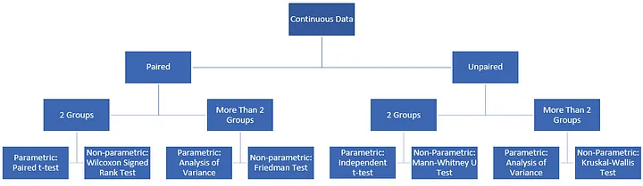
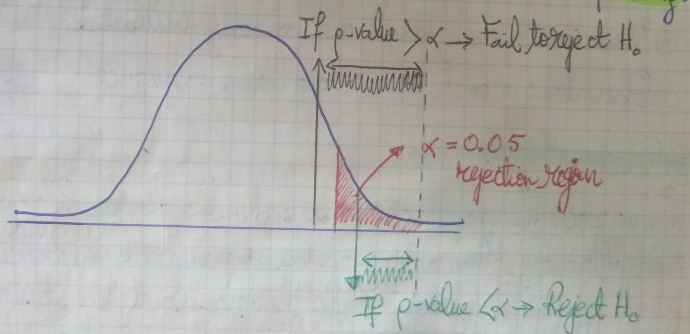

<h1 style="text-align:center;">Parametric Test Vs Non-Parametric Test</h1>


<u>**Author</u> :** [Younes Dahami](https://www.linkedin.com/in/dahami/)

<a id="top"></a>

<div class="list-group" id="list-tab" role="tablist">
<h3 class="list-group-item list-group-item-action active" data-toggle="list"  role="tab" aria-controls="home">Table of contents</h3>
    
<font color="blue" size=+1><b>[0. Introduction](#0)</b></font>
    
<font color="blue" size=+1><b>[1. Parametric Tests](#1)</b></font>
    
<font color="blue" size=+1><b>[2. Non-Parametric Tests](#2)</b></font>

<font color="blue" size=+1><b>[3. Hypothesis Testing](#3)</b></font>
* [3.1 Defining Hypotheses](#3.1)
* [3.2 Assumption Check](#3.2) 
* [3.3 Selecting the Proper Test](#3.3)
* [3.4 Decision and Conclusion](#3.4)
    
    
<font color="blue" size=+1><b>[4. Tests Examples](#4)</b></font>
* [4.1 Independent t-test / Two-sample t-test / Unpaired t-test](#4.1)
    * [4.1.1 Definition](#4.1.1)
    * [4.1.2 Example of Independent t-test](#4.1.2)
    
* [4.2 Analysis of Variance (ANOVA)](#4.2)
    * [4.2.1 Definition](#4.2.1)
    * [4.2.2 Example of ANOVA](#4.2.2)
    
* [4.3 Mann Whitney U / Wilcoxon rank-sum test](#4.3)
    * [4.3.1 Definition](#4.3.1)
    * [4.3.2 Example of Mann Whitney U / Wilcoxon rank-sum test](#4.3.2)
    
 
* [4.4 Kruskal-Wallis test](#4.4)
    * [4.4.1 Definition](#4.4.1)
    * [4.4.2 Example of Kruskal-Wallis test](#4.4.2)
    
    
* [4.5 Dependent t-Test / Paired t-Test](#4.5)
    * [4.5.1 Definition](#4.5.1)
    * [4.5.2 Example of Dependent t-Test (Paired t-Test)](#4.5.2)
    
    
* [4.6 Wilcoxon Signed-Rank test](#4.6)
    * [4.6.1 Definition](#4.6.1)
    * [4.6.2 Example of Wilcoxon Signed-Rank test](#4.6.2)
    
* [4.7 Friedman $\chi$² (Chi-Square)](#4.7)
    * [4.7.1 Definition](#4.7.1)
    * [4.7.2 Example of Friedman $\chi$² (Chi-Square)](#4.7.2)
    
* [4.8 $\chi^2$ Test for Independence](#4.8)
    * [4.8.1 Definition](#4.8.1)
    * [4.8.2 Example of $\chi^2$ Test for Independence](#4.8.2)

    


<a id="0"></a>

# Introduction

You want to calculate a hypothesis test, but you don't know exactly what's the difference is between **parametric** and **non-parametric** tests, and you're wondering when to use each test.

If you want to calculate a hypothesis test, you must first check the assumptions. One of the most common assumptions is the data used must show a **certain distribution**, usually the normal distribution.

To simply put it :

* If your data is **normally distributed**, use the **parametric tests** e.g. : t-test, ANOVA or Pearson Correlation.

* If your data is **not normally distributed**, use the **non-parametric tests** e.g. : Mann-Whitney U test or a Spearman Correlation.

Of course you still have to check if there are further assumptions for the respective test. But in general, there are less assumptions for non-parametric tests than for parametric tests.

Parametric tests are generally mor powerful than non-parametric tests.

<a id="1"></a>

# 1) Parametric Tests

**<u>Parametric tests</u>** **:** are statistical tests that make assumptions about the parameters of the population distribution from which the samples are drawn. Specifically, they assume that the data follows a certain distribution (usually a normal distribution) and often involve estimating parameters such as the mean and standard deviation.

Key Characteristics :

* **Assumption of Normality :** Data should be normally distributed or approximately normally distributed.
* **Homogeneity of Variances :** Assumes equal variances among the groups being compared.
* **Scale of Measurement :** Typically requires data that is at least interval scale.

**<u>Examples</u>** **:** t-tests (independent and paired), ANOVA (Analysis of Variance), and linear regression.

<a id="2"></a>

# 2) Non-Parametric Tests

**<u>Non-parametric tests</u>** **:** are statistical tests that do not assume a specific distribution for the data. They are used when the assumptions of parametric tests are not met, particularly when the data does not follow a normal distribution or when dealing with ordinal data or non-quantitative data.

Key Characteristics :

* **No Assumption of Distribution :** Does not require the data to follow a normal distribution.
* **Flexible with Data Types :** Can handle ordinal data, ranks, and non-quantitative data.

**<u>Examples</u>** **:** Mann-Whitney U test, Wilcoxon signed-rank test, Kruskal-Wallis test, and Spearman's rank correlation.

Parametric tests are more powerful when their assumptions are met because they use more information from the data, while non-parametric tests are more versatile and can be applied to a wider range of data types and distributions.

|                                    | Parametric Tests        | Non-Parametric Tests         | 
| ---------------------------------- | ----------------------- | --------------------------   | 
| **One Sample**                       | Simple t-Test           | Wilcoxon Test for One Sample |   
| **Two dependent Samples**              | Paired Sample t-Test    | Wilcoxon Test                | 
| **Two independent Samples**            | Unpaired Sample t-Test  | Mann-Whitney U Test          |   
| **More than two independent Samples**  | One Factorial ANOVA     | Kruskal-Wallis Test          |   
| **More than two dependent Samples**    | Repeated Measures ANOVA | Friedman Test                |   
| **Correlation Between Two Variables**  | Pearson Correlation     | Spearman Correlation         |   


<a id="3"></a>

# 3) Hypothesis Testing 

Hypotheses are claims (assertions) that can be verified or refuted using statistical methods. Hypothesis testing organizes these assertions into a framework, allowing us to use statistical evidence to evaluate their validity. This process enables us to determine whether the claims hold true or not.

In this notebook, I will demonstrate hypothesis testing with Python through several step-by-step examples. But first, let me briefly explain the hypothesis testing process. If you prefer, you can skip directly to the questions.

<a id="3.1"></a>
## 3.1) Defining Hypotheses

First, we need to identify the scientific question we aim to answer and formulate it as the Null Hypothesis $(H_0)$ and the Alternative Hypothesis ($H_{1}$ or $H_{a}$). Remember that $(H_0)$ and $H_{1}$ must be mutually exclusive, and $H_{1}$ should not include equality :

$H_0 : \mu = x, H_{1}: μ \neq x$

$H_0 : \mu \leq x, H_{1}: μ > x$

$H_0 : \mu \geq x, H_{1}: μ < x$

<a id="3.2"></a>
## 3.2) Assumption Check

To determine whether to use the **parametric** or **non-parametric** version of the test, we need to verify the following requirements :

* Observations in each sample are independent and identically distributed (iid).
* Observations in each sample are normally distributed.
* Observations in each sample have the same variance.

<a id="3.3"></a>
## 3.3) Selecting the Proper Test

Next, we need to choose the appropriate test. It's crucial to analyze the number of groups being compared and whether the data are paired or not. To determine if the data are matched, consider whether the data were collected from the same individuals. Based on these factors, you can select the appropriate test using the chart below.




<a id="3.4"></a>
## 3.4) Decision and Conclusion

After performing hypothesis testing, we obtain a **p-value** that indicates the significance of the test.

If the p-value is smaller than the alpha level (the significance level $\alpha$), there is enough evidence to reject $H_0$. Otherwise, we fail to reject $H_0$. Remember, rejecting $H_0$ supports $H_{1}$, but failing to reject $H_0$ does not confirm $H_0$'s validity nor does it indicate that $H_{1}$ is incorrect.



<a id="4"></a>
# 4) Tests Examples

<a id="4.1"></a>

## 4.1) Independent t-test / Two-sample t-test / Unpaired t-test

<a id="4.1.1"></a>

### 4.1.1) Definition

* <u>**independent t-test**</u> **:** also known as the **two-sample t-test** or **unpaired t-test**, is a statistical test used to compare the means of two independent groups to determine if there is a statistically significant difference between them. This test is appropriate when you have two unrelated groups and you want to compare their means.

#### Assumptions

1. **Independence :** The two samples must be independent of each other. This means that the data points in one group should not influence the data points in the other group.
2. **Normality :** The data in each group should be approximately normally distributed. This assumption can be relaxed with large sample sizes due to the Central Limit Theorem.
3. **Homogeneity of Variances (homoscedasticity) :**  The variances of the two groups should be approximately equal. This can be checked using tests such as Levene's test.

#### Hypotheses

- **Null Hypothesis $(H_0)$**: The means of the two groups are equal $(\mu_1 \leq \mu_2).$
- **Alternative Hypothesis $(H_1)$**: The means of the two groups are not equal $(\mu_1 \neq \mu_2).$ for a two-tailed test, or $(\mu_1 > \mu_2).$ or $(\mu_1 < \mu_2).$ for a one-tailed test.

#### Test Statistic

The test statistic for the independent t-test is calculated as follows:

$$
t = \frac{\bar{X}_1 - \bar{X}_2}{\sqrt{\frac{s_1^2}{n_1} + \frac{s_2^2}{n_2}}}
$$

where :
- $\bar{X}_1$ and $\bar{X}_2$ are the sample means,
- $s_1^2$ and $s_2^2$ are the sample variances,
- $n_1$ and $n_2$ are the sample sizes.

The degrees of freedom for the test are calculated using the following formula when assuming equal variances :
$$
df = n_1 + n_2 - 2
$$

<a id="4.1.2"></a>

### 4.1.2) Example of Independent t-test 


A university professor transitioned from face-to-face classes to online lectures due to Covid-19. Subsequently, he uploaded recorded lectures to the cloud for students who chose to follow the course asynchronously. Despite this, he maintains a belief that students who attend the live classes and actively participate are more successful. To investigate this, he recorded the average grades of students at the end of the semester. The data is presented below.

synchronous = [93.2, 85.3, 82.9, 68.5, 79.9, 80.6, 80.9, 77.2, 81.5, 79.1, 72.3, 88.1, 86.8, 94.1, 83.6, 78.7, 77.4, 70.6, 89.1, 75.6, 73.9, 81.2]

asynchronous = [76.9, 71.3, 91.4, 71.5, 75.3, 84.9, 68.1, 70.5, 75.7, 71.2, 65.9, 72.4, 71.1, 78.5]

Perform hypothesis testing to determine the statistical significance of the professor's belief, using a significance level of 0.05 to assess the null and alternative hypotheses. Before conducting hypothesis testing, verify the relevant assumptions. Provide commentary on the obtained results.

#### <u>1. Defining Hypotheses</u>

Since the grades are obtained from different individuals, the data is unpaired.

* Null Hypothesis $(H_0) :$ The mean grade of students who attend live classes is less than or equal to the mean grade of students who watch recorded lectures.

$$H_0 : \mu_s \leq \mu_a$$

$s :$ synchronous

$a :$ asynchronous


* Alternative Hypothesis $(H_1) :$ The mean grade of students who attend live classes is greater than the mean grade of students who watch recorded lectures.

$$H_1 : \mu_s > \mu_a$$


#### <u>2. Assumption Check</u>

* Null Hypothesis $(H_0) :$ The data is normally distributed.
* Alternative Hypothesis $(H_1) :$ The data is not normally distributed.

Assuming $\alpha=0.05,$ if the p-value is $>0.05,$ we can conclude that the data is normally distributed.
For assessing normality, I employed the **Shapiro-Wilk test,** which is typically favored for smaller samples. However, other options such as the Kolmogorov-Smirnov and D’Agostino and Pearson’s tests are available. Please refer to [stats](https://docs.scipy.org/doc/scipy/reference/stats.html)'s documentation for further details.


```python
import numpy as np
from scipy import stats
```


```python
def normality_check(data):
    """Checks if the data is normally distributed"""
    
    test_stat_normality, p_value_normality=stats.shapiro(data)
    print("p value:%.4f" % p_value_normality)
    if p_value_normality <0.05:
        print("Reject null hypothesis => The data is not normally distributed")
    else:
        print("Fail to reject null hypothesis => The data is normally distributed")
```


```python
sync = np.array([93.2, 85.3, 82.9, 68.5, 79.9, 80.6, 80.9, 77.2, 81.5, 79.1, 72.3, 88.1, 86.8,
                 94.1, 83.6, 78.7, 77.4, 70.6, 89.1, 75.6, 73.9, 81.2])
asyncr = np.array([76.9, 71.3, 91.4, 71.5, 75.3, 84.9, 68.1, 70.5, 75.7, 71.2, 65.9, 72.4, 71.1, 78.5])
normality_check(sync)
normality_check(asyncr)
```

    p value:0.9515
    Fail to reject null hypothesis => The data is normally distributed
    p value:0.0548
    Fail to reject null hypothesis => The data is normally distributed
    

$H_0 :$ The variances of the samples are the same.

$H_1 :$ The variances of the samples are different.


```python
def variance_check_homogeneity(group1, group2):
    """Checks if two samples have the same variance"""
    
    test_stat_var, p_value_var= stats.levene(group1,group2)
    print("p value:%.4f" % p_value_var)
    if p_value_var <0.05:
        print("Reject null hypothesis => The variances of the samples are different.")
    else:
        print("Fail to reject null hypothesis => The variances of the samples are same.")
```

It tests the null hypothesis that the population variances are equal, a concept known as **homogeneity of variance**b or **homoscedasticity.** If the resulting p-value from Levene’s test is less than the significance level (typically 0.05), it suggests that the observed differences in sample variances are unlikely to have occurred due to random sampling from a population with equal variances.

I used Levene’s test to check for variance homogeneity, but you can also use Bartlett’s test. For more information, visit: [scipy.stats.bartlett](https://docs.scipy.org/doc/scipy/reference/generated/scipy.stats.bartlett.html#scipy.stats.bartlett)'s documentation.


```python
variance_check_homogeneity(sync, asyncr)
```

    p value:0.7817
    Fail to reject null hypothesis => The variances of the samples are same.
    

#### <u>3. Selecting the proper test</u>

Since the assumptions are satisfied, we can proceed with the parametric version of the test for two groups with unpaired data.


```python
ttest, p_value = stats.ttest_ind(sync, asyncr)
print("p value : %.8f" % p_value)
print("Since the hypothesis is one sided => use p-value/2 => p-value-one-sided : %.4f" %(p_value/2))
if p_value/2 < 0.05 :
    print("Reject the Null Hypothesis")
else :
    print("Fail to reject the Null Hypothesis")
```

    p value : 0.00988899
    Since the hypothesis is one sided => use p-value/2 => p-value-one-sided : 0.0049
    Reject the Null Hypothesis
    


```python
ttest
```


    2.732898234545415


#### <u>4. Decision and Conclusion</u>

At this significance level, there is sufficient evidence to conclude that the average grade of students who follow the course synchronously is higher than that of students who follow the course asynchronously.

<a id="4.2"></a>

## 4.2) Analysis of Variance (ANOVA)

<a id="4.2.1"></a>
### 4.2.1) Definition

* <u>**Analysis of Variance (ANOVA)**</u> **:** is a statistical method used to compare the means of three or more independent groups to determine if there are statistically significant differences between them. ANOVA tests the null hypothesis that the means of the groups are equal. The types of ANOVA are :

1. **One-Way ANOVA :** Compares the means of three or more independent groups.
2. **Two-Way ANOVA :** Analyzes the effects of two categorical independent variables on a continuous dependent variable.
3. **Repeated Measures ANOVA :** Analyzes the effects of one or more within-subjects factors (repeated measures) on a continuous dependent variable.


#### Assumptions

1. **Independence :** The observations within each group should be independent of each other.
2. **Normality :** The data in each group should be approximately normally distributed.
3. **Homogeneity of Variances (homoscedasticity) :** The variances of the groups should be approximately equal.

#### Hypotheses

- **Null Hypothesis $(H_0)$ :** The means of all groups are equal.
- **Alternative Hypothesis $(H_1)$ :** At least one group mean is different from the others.


#### Test Statistic

The test statistic for ANOVA follows an F-distribution. The F-statistic is calculated as the ratio of the between-group variance to the within-group variance :

$$
F = \frac{{\text{Between-group variability}}}{{\text{Within-group variability}}}
$$

#### Post Hoc Tests

After finding a significant result in ANOVA, post hoc tests are often performed to identify which specific group means differ from each other. Common post hoc tests include Tukey's HSD (Honestly Significant Difference), Bonferroni, Scheffe, and Dunnett's tests.

<a id="4.2.2"></a>

### 4.2.2) Example of ANOVA


A pediatrician aims to examine the effect of formula consumption on the average monthly weight gain (in grams) of babies. To do this, he collected data from three different groups : 

* The first group consists of exclusively breastfed children (receiving only breast milk).
* The second group includes children fed only with formula.
* The third group comprises children who are both formula-fed and breastfed.

The data is presented below :

only_breast = [783.2, 720.1, 990.3, 725.4, 759.2, 905.6, 662.5, 691.4, 765.2, 718.6, 631.9, 732.8, 716.3, 808.9, 585.7, 682.3, 863.5]

only_formula = [900.1, 880.3, 938.4, 965.1, 958.7, 1060.2, 1047.8, 978.9, 894.1, 921.5, 1073.6, 953.4, 798.2, 858.7, 872.4, 1045.9, 918.2, 1161.8, 995.3]

both = [975.3, 658.1, 862.5, 708.9, 719.2, 718.4, 760.7, 893.1, 868.9, 806.3, 764.2, 802.7, 791.4, 874.5, 741.2, 797.8, 789.1, 794.3, 822.1, 820.3, 928.4, 793.5, 949.6]

Based on this information, conduct hypothesis testing to determine whether there is a difference in the average monthly weight gain among the three groups, using a significance level of 0.05. If a significant difference is found, perform further analysis to identify the cause of the difference. Before conducting hypothesis testing, verify the relevant assumptions.

#### <u>1. Defining Hypotheses</u>

* Null Hypothesis $H_0$ : The mean of the samples is the same

$$H_0 : \mu_1 = \mu_2 = \mu_3$$

* Alternative Hypothesis $H_1$ : At least one of them is different

$$H_1 : \mu_1 \neq \mu_2 \quad or \quad \mu_1 \neq \mu_3 \quad or \quad \mu_2 \neq \mu_3$$

#### <u>2. Assumptions Check</u>

* **Normality :**

$H_0 :$ "The data is normally distributed"

$H_1 :$ "The data is **NOT** normally distributed"

* **Homoscedasticity :**

$H_0 :$ "The variances of the samples are the same"

$H_1 :$ "The variances of the samples are different"


```python
breast_only = np.array([783.2, 720.1, 990.3, 725.4, 759.2, 905.6, 662.5, 691.4, 765.2, 718.6, 631.9, 732.8, 716.3, 808.9, 585.7, 682.3, 863.5])
formula_only = np.array([900.1, 880.3, 938.4, 965.1, 958.7, 1060.2, 1047.8, 978.9, 894.1, 921.5, 1073.6, 953.4, 798.2, 858.7, 872.4, 1045.9, 918.2, 1161.8, 995.3])
both = np.array( [975.3, 658.1, 862.5, 708.9, 719.2, 718.4, 760.7, 893.1, 868.9, 806.3, 764.2, 802.7, 791.4, 874.5, 741.2, 797.8, 789.1, 794.3, 822.1, 820.3, 928.4, 793.5, 949.6])
```


```python
# Normality Check :

normality_check(breast_only)
normality_check(formula_only)
normality_check(both)
```

    p value:0.4133
    Fail to reject null hypothesis => The data is normally distributed
    p value:0.8721
    Fail to reject null hypothesis => The data is normally distributed
    p value:0.7610
    Fail to reject null hypothesis => The data is normally distributed
    


```python
# Homoscedasticity check

stat, p_value_levene = stats.levene(breast_only, formula_only, both)
print("p-value : %.4f"%p_value_levene)
if p_value_levene < 0.05 :
    print("Reject null hypothesis => The variances of the samples are different")
else :
    print("Fail to reject the null hypothesis => The variances of the samples are the same")
```

    p-value : 0.8109
    Fail to reject the null hypothesis => The variances of the samples are the same
    

#### <u>3. Selecting the proper test</u>

Since the assumptions are satisfied, we can proceed with the parametric version of the test for **more than two groups** with **unpaired** data.


```python
# Performing One-way ANOVA
F_test, p_value = stats.f_oneway(breast_only, formula_only, both)
print("p-value : %.6f" %p_value)
if p_value < 0.05 :
    print("Reject the null hypothesis")
else :
    print("Fail to reject the null hypothesis")
```

    p-value : 0.000000
    Reject the null hypothesis
    

#### <u>4. Decision and Conclusion</u>

At this significance level (of 0.05), it can be concluded that at least one of the groups has a different average monthly weight gain. To determine which group or groups are causing the difference, we need to conduct a **posthoc test** or **pairwise comparison.**

**Note :** To prevent family-wise p-value inflation, I applied the Bonferroni adjustment. Alternatively, you can explore other options here: [scikit_posthocs.posthoc_ttest documentation](https://scikit-posthocs.readthedocs.io/en/latest/generated/scikit_posthocs.posthoc_ttest.html)

Pairwise T-test for multiple comparisons of independent groups, can be utilized after conducting a parametric ANOVA to perform pairwise comparisons.


```python
#pip install scikit-posthocs
```


```python
import scikit_posthocs as sp

df_posthoc = sp.posthoc_ttest([breast_only, formula_only, both],
                             equal_var = True,   # Homoscedasticity verified!
                             p_adjust = "bonferroni")

groups = ["Breast Only", "Formula Only", "Both"]
df_posthoc.columns = groups
df_posthoc.index = groups

df_posthoc.style.applymap(lambda x: "background-color:red" if x<0.05 else "background-color:white")

```


<style type="text/css">
#T_92fde_row0_col0, #T_92fde_row0_col2, #T_92fde_row1_col1, #T_92fde_row2_col0, #T_92fde_row2_col2 {
  background-color: white;
}
#T_92fde_row0_col1, #T_92fde_row1_col0, #T_92fde_row1_col2, #T_92fde_row2_col1 {
  background-color: red;
}
</style>
<table id="T_92fde">
  <thead>
    <tr>
      <th class="blank level0" >&nbsp;</th>
      <th id="T_92fde_level0_col0" class="col_heading level0 col0" >Breast Only</th>
      <th id="T_92fde_level0_col1" class="col_heading level0 col1" >Formula Only</th>
      <th id="T_92fde_level0_col2" class="col_heading level0 col2" >Both</th>
    </tr>
  </thead>
  <tbody>
    <tr>
      <th id="T_92fde_level0_row0" class="row_heading level0 row0" >Breast Only</th>
      <td id="T_92fde_row0_col0" class="data row0 col0" >1.000000</td>
      <td id="T_92fde_row0_col1" class="data row0 col1" >0.000000</td>
      <td id="T_92fde_row0_col2" class="data row0 col2" >0.115376</td>
    </tr>
    <tr>
      <th id="T_92fde_level0_row1" class="row_heading level0 row1" >Formula Only</th>
      <td id="T_92fde_row1_col0" class="data row1 col0" >0.000000</td>
      <td id="T_92fde_row1_col1" class="data row1 col1" >1.000000</td>
      <td id="T_92fde_row1_col2" class="data row1 col2" >0.000004</td>
    </tr>
    <tr>
      <th id="T_92fde_level0_row2" class="row_heading level0 row2" >Both</th>
      <td id="T_92fde_row2_col0" class="data row2 col0" >0.115376</td>
      <td id="T_92fde_row2_col1" class="data row2 col1" >0.000004</td>
      <td id="T_92fde_row2_col2" class="data row2 col2" >1.000000</td>
    </tr>
  </tbody>
</table>


At this significance level, it can be concluded that the "only formula" group differs from both the "only breast" and "both" groups.


<a id="4.3"></a>

## 4.3) Mann Whitney U / Wilcoxon rank-sum test

<a id="4.3.1"></a>

### 4.3.1) Definition

* <u>**The Mann-Whitney U test**</u> **:** also known as the **Wilcoxon rank-sum test,** is a non-parametric statistical test used to compare the means of two independent groups when the assumptions of the independent t-test are not met (e.g., when the data is not normally distributed or the variances are not equal).


#### Assumptions

The Mann-Whitney U test does not assume normality or homogeneity of variances. However, it does assume that the observations in each group are independent.

#### Hypotheses

- **Null Hypothesis $(H_0)$ :** The distributions of both groups are equal.
- **Alternative Hypothesis $(H_1)$ :** The distributions of both groups are not equal.

#### Test Statistic

The test statistic for the Mann-Whitney U test is based on the ranks of the observations in the combined sample of the two groups. The $U$ statistic is calculated as the sum of the ranks of the observations in one group, and it is compared to a critical value to determine statistical significance.


<a id="4.3.2"></a>

### 4.3.2) Example of Mann Whitney U test


A human resource specialist at a technology company is interested in comparing the overtime hours of different teams. To explore whether there's a difference between the overtime hours of the software development team and the test team, the specialist randomly selected 17 employees from each team and recorded their weekly average overtime hours. The data is provided below.

tester_team = [6.5, 7.0, 1.8, 2.2, 2.4, 1.9, 1.7, 6.3, 2.6, 2.2, 12.1, 1.6, 5.1, 3.3, 9.0, 2.5, 4.0]

developer_team = [2.2, 2.0, 1.5, 2.1, 8.5, 2.3, 3.0, 4.0, 3.5, 2.4, 3.0, 6.0, 12.0, 4.0, 2.0, 1.3, 3.3]

Based on this data, perform hypothesis testing to examine whether there exists a difference in the overtime hours between two teams, utilizing a significance level of 0.05. Before proceeding with hypothesis testing, ensure to verify the associated assumptions.

#### <u>1. Defining Hypotheses</u>

* Null Hypothesis $H_0$ : The mean of the two samples is the same

$$H_0 : \mu_t = \mu_d$$

* Alternative Hypothesis $H_1$ : The two samples have different means

$$H_1 : \mu_t \neq \mu_d$$


#### <u>2. Assumptions Check</u>

* **Normality :**

$H_0 :$ "The data is normally distributed" (The overtime data for both teams should follow a normal distribution.)

$H_1 :$ "The data is **NOT** normally distributed"

* **Homoscedasticity :**

$H_0 :$ "The variances of the samples are the same" (The variance in overtime hours should be approximately equal between the two teams.)

$H_1 :$ "The variances of the samples are different"


```python
tester_team = np.array([6.5, 7.0, 1.8, 2.2, 2.4, 1.9, 1.7, 6.3, 2.6, 2.2, 12.1, 1.6, 5.1, 3.3, 9.0, 2.5, 4.0])
developer_team = np.array([2.2, 2.0, 1.5, 2.1, 8.5, 2.3, 3.0, 4.0, 3.5, 2.4, 3.0, 6.0, 12.0, 4.0, 2.0, 1.3, 3.3])

# Normality check
normality_check(tester_team)
normality_check(developer_team)

# Homoscedasticity check
variance_check_homogeneity(tester_team, developer_team)
```

    p value:0.0042
    Reject null hypothesis => The data is not normally distributed
    p value:0.0003
    Reject null hypothesis => The data is not normally distributed
    p value:0.5592
    Fail to reject null hypothesis => The variances of the samples are same.
    

#### <u>3. Selecting the proper test</u>

Since there are two groups with data collected from different individuals, it's **unpaired.** However, the normality assumption is not met. Therefore, we should use the non-parametric version of a two-group comparison for unpaired data, which is the **Mann-Whitney U test.**


```python
ttest, p_value = stats.mannwhitneyu(x = tester_team,
                                  y = developer_team,
                                  alternative = "two-sided")

print("p-value : %.4f"%p_value)
if p_value < 0.05 :
    print("Reject the null hypothesis")
else :
    print("Fail to reject the null hypothesis")
```

    p-value : 0.6540
    Fail to reject the null hypothesis
    

#### <u>4. Decision and Conclusion</u>

At this significance level, there is no statistically significant difference between the average overtime hours of the two teams.

<a id="4.4"></a>

## 4.4) Kruskal-Wallis test

<a id="4.4.1"></a>

### 4.4.1) Definition

* <u>**Kruskal-Wallis test**</u> **:** is a non-parametric statistical test used to compare the means of three or more independent groups when the assumptions of the one-way ANOVA are not met (e.g., when the data is not normally distributed or the variances are not equal). It is often referred to as the non-parametric equivalent of the one-way ANOVA.

#### Assumptions

The Kruskal-Wallis test does not assume normality or homogeneity of variances. However, it does assume that the observations in each group are independent.

#### Hypotheses

- **Null Hypothesis $(H_0)$ :** The distributions of all groups are equal.
- **Alternative Hypothesis $(H_1)$ :** At least one group's distribution is different from the others.

#### Test Statistic

The test statistic for the Kruskal-Wallis test is based on the ranks of the observations in the combined sample of the groups. It compares the average ranks between groups to determine if there are significant differences.


<a id="4.4.2"></a>

### 4.4.2) Example of Kruskal-Wallis test


An e-commerce company frequently advertises its campaigns on YouTube, Instagram, and Facebook. However, the new manager is curious about whether there is any difference in the number of customers attracted by these platforms. Consequently, she began utilizing "Adjust", an application that provides insights to find out where the users came from. The daily numbers reported from Adjust for each platform are as follows :

Youtube = [1905, 1885, 1945, 2135, 2045, 2125, 2120, 2150, 2030, 1980, 1950, 2140, 2155, 1945, 2135]

Instagram = [2295, 2365, 2205, 2225, 2195, 2425, 2380, 2415, 2335, 2355, 2245, 2400, 2235, 2270, 2275]

Facebook = [2125, 2530, 2110, 2555, 2285, 2375, 2450, 2315, 2180, 2120, 2055, 2435, 2270, 2105, 2535]

Based on this data, perform hypothesis testing to examine whether there are differences in the average customer acquisition across the three platforms, using a significance level of 0.05. Should a significant difference be observed, conduct additional analysis to detect the underlying cause. Prior to hypothesis testing, ensure to validate the relevant assumptions.

#### <u>1. Defining Hypotheses</u>

* Null Hypothesis $H_0$ : The mean of the samples is the same

$$H_0 : \mu_Y = \mu_I = \mu_F$$

* Alternative Hypothesis $H_1$ : At least one of them is different

$$H_1 : \mu_Y \neq \mu_I \quad or \quad \mu_Y \neq \mu_F \quad or \quad \mu_I \neq \mu_F$$


#### <u>2. Assumptions Check</u>

* **Normality :**

$H_0 :$ "The data is normally distributed" (The number of customers acquired from each platform should follow a normal distribution.)

$H_1 :$ "The data is **NOT** normally distributed"

* **Homoscedasticity :**

$H_0 :$ "The variances of the samples are the same" (The variance in the number of customers acquired should be approximately equal between the three platforms.)

$H_1 :$ "The variances of the samples are different"


```python
youtube = np.array([1905, 1885, 1945, 2135, 2045, 2125, 2120, 2150, 2030, 1980, 1950, 2140, 2155, 1945, 2135])
instagram = np.array([2295, 2365, 2205, 2225, 2195, 2425, 2380, 2415, 2335, 2355, 2245, 2400, 2235, 2270, 2275])
facebook = np.array([2125, 2530, 2110, 2555, 2285, 2375, 2450, 2315, 2180, 2120, 2055, 2435, 2270, 2105, 2535])

# Normality check
normality_check(youtube)
normality_check(instagram)
normality_check(facebook)

# Homoscedasticity check
stat, p_value_levene = stats.levene(youtube, instagram, facebook)
print("p-value : %.4f"%p_value_levene)
if p_value_levene < 0.05 :
    print("Reject the null hypothesis => The variances of the samples are different.")
else :
    print("Fail to reject the null hypothesis => The variances of the samples are the same.")
```

    p value:0.0258
    Reject null hypothesis => The data is not normally distributed
    p value:0.2898
    Fail to reject null hypothesis => The data is normally distributed
    p value:0.1402
    Fail to reject null hypothesis => The data is normally distributed
    p-value : 0.0015
    Reject the null hypothesis => The variances of the samples are different.
    

#### <u>3. Selecting the proper test</u>

Since the assumptions of normality and variance homogeneity are not met, we should employ the non-parametric version of ANOVA for unpaired data, as the data is collected from different sources, which is the **Kruskal-Wallis test.**


```python
F_test, p_value = stats.kruskal(youtube, instagram, facebook)
print("p-value : %.6f"%p_value)
if p_value <0.05 :
    print("Reject the null hypothesis")
else : 
    print("Fail to reject the null hypothesis")
```

    p-value : 0.000019
    Reject the null hypothesis
    

#### <u>4. Decision and Conclusion</u>

At this significance level, there is evidence to suggest that at least one of the average customer acquisition numbers differs across the platforms.

**Note :** Due to the non-normality of the data, the **non-parametric version of the posthoc test** is employed.


```python
import scikit_posthocs as sp

df_posthoc = sp.posthoc_mannwhitney([youtube, instagram, facebook],
                                   p_adjust = "bonferroni")

company_names = ["Youtube", "Instagram", "Facebook"]
df_posthoc.columns = company_names
df_posthoc.index = company_names

df_posthoc.style.applymap(lambda x : "background-color:red" if x<0.05 else "background-color:white")

```


<style type="text/css">
#T_9e018_row0_col0, #T_9e018_row1_col1, #T_9e018_row1_col2, #T_9e018_row2_col1, #T_9e018_row2_col2 {
  background-color: white;
}
#T_9e018_row0_col1, #T_9e018_row0_col2, #T_9e018_row1_col0, #T_9e018_row2_col0 {
  background-color: red;
}
</style>
<table id="T_9e018">
  <thead>
    <tr>
      <th class="blank level0" >&nbsp;</th>
      <th id="T_9e018_level0_col0" class="col_heading level0 col0" >Youtube</th>
      <th id="T_9e018_level0_col1" class="col_heading level0 col1" >Instagram</th>
      <th id="T_9e018_level0_col2" class="col_heading level0 col2" >Facebook</th>
    </tr>
  </thead>
  <tbody>
    <tr>
      <th id="T_9e018_level0_row0" class="row_heading level0 row0" >Youtube</th>
      <td id="T_9e018_row0_col0" class="data row0 col0" >1.000000</td>
      <td id="T_9e018_row0_col1" class="data row0 col1" >0.000010</td>
      <td id="T_9e018_row0_col2" class="data row0 col2" >0.003134</td>
    </tr>
    <tr>
      <th id="T_9e018_level0_row1" class="row_heading level0 row1" >Instagram</th>
      <td id="T_9e018_row1_col0" class="data row1 col0" >0.000010</td>
      <td id="T_9e018_row1_col1" class="data row1 col1" >1.000000</td>
      <td id="T_9e018_row1_col2" class="data row1 col2" >1.000000</td>
    </tr>
    <tr>
      <th id="T_9e018_level0_row2" class="row_heading level0 row2" >Facebook</th>
      <td id="T_9e018_row2_col0" class="data row2 col0" >0.003134</td>
      <td id="T_9e018_row2_col1" class="data row2 col1" >1.000000</td>
      <td id="T_9e018_row2_col2" class="data row2 col2" >1.000000</td>
    </tr>
  </tbody>
</table>


The average number of customers coming from YouTube is significantly different from the others, being notably smaller.


<a id="4.5"></a>

## 4.5) Dependent t-Test / Paired t-Test

<a id="4.5.1"></a>

### 4.5.1) Definition

* <u>**Dependent t-test**</u> **:** also known as the **paired t-test,** is a statistical test used to compare the means of two related groups to determine if there is a statistically significant difference between them. This test is appropriate when the same subjects are measured before and after an intervention or treatment, or when the measurements are matched in some way.

#### Assumptions

1. **Dependent Observations :** The observations in each group should be dependent or paired in some way. Typically, this means that each subject is measured under two different conditions.
2. **Normality :** The differences between pairs of observations should be approximately normally distributed.
3. **Homogeneity of Differences :** The differences between pairs of observations should have a constant variance.

#### Hypotheses

- **Null Hypothesis $(H_0)$ :** The mean difference between paired observations is zero $(\mu_d =0)$.
- **Alternative Hypothesis $(H_1)$ :** The mean difference between paired observations is not zero $(\mu_d \neq 0)$ for a two-tailed test, or $(\mu_d > 0)$ or $(\mu_d < 0)$ for a one-tailed test.

#### Test Statistic

The test statistic for the dependent t-test is calculated as follows :

$$
t = \frac{\bar{d}}{\frac{s_d}{\sqrt{n}}}
$$

where:
- $\bar{d} = \bar{X_2}-\bar{X_1}$ is the mean difference between paired observations,
- $s_d$ is the standard deviation of the differences between paired observations,
- $n$ is the number of pairs.


<a id="4.5.2"></a>

### 4.5.2) Example of a Dependent t-Test (Paired t-Test)


Eighteen students diagnosed with high cholesterol at the University Health Center were advised by healthcare personnel about the risks associated with high cholesterol and were prescribed a diet program. After one month, the patients returned for a follow-up, during which their cholesterol levels were reevaluated. Test whether there is a change in the cholesterol levels of the patients after the diet intervention.

Based on this information, perform hypothesis testing to determine whether there is a reduction in the cholesterol levels of the patients following the diet, using a significance level of 0.05. Prior to hypothesis testing, assess the relevant assumptions. Provide commentary on the results.

results_before_diet = [226, 233, 220, 252, 254, 220, 242, 227, 258, 222, 240, 238, 237, 230, 274, 252, 236, 228]

results_after_diet = [196, 197, 215, 189, 245, 207, 224, 198, 212, 209, 187, 204, 201, 219, 191, 197, 193, 220]

Since the same individuals are being measured before and after the diet, the observations are paired.

#### <u>1. Defining Hypotheses</u>

* Null Hypothesis $H_0$ : The true mean difference $\mu_d = \mu_{\text{after}} - \mu_{\text{before}}$ is equal to or bigger than zero.

$$H_0 : \mu_d \geq 0$$

* Alternative Hypothesis $H_1$ : The true mean difference is smaller than zero

$$H_1 : \mu_d <0 $$


#### <u>2. Assumptions Check</u>

* **Continuity :**

The dependent variable must be **continuous (interval/ratio).**

* **Independence :**

The observations are **independent of one another.**

* **Normality :**

The dependent variable should be approximately **normally distributed**

$H_0 :$ "The data is normally distributed" (The cholesterol level data should follow a normal distribution.)

$H_1 :$ "The data is **NOT** normally distributed"


```python
before_diet = np.array([226, 233, 220, 252, 254, 220, 242, 227, 258, 222, 240, 238, 237, 230, 274, 252, 236, 228])
after_diet = np.array([196, 197, 215, 189, 245, 207, 224, 198, 212, 209, 187, 204, 201, 219, 191, 197, 193, 220])

# normality check

normality_check(before_diet)
normality_check(after_diet)
```

    p value:0.2104
    Fail to reject null hypothesis => The data is normally distributed
    p value:0.1441
    Fail to reject null hypothesis => The data is normally distributed
    

#### <u>3. Selecting the proper test</u>

The data is paired as it is collected from the same individuals, and the assumptions are satisfied. Therefore, we can employ the **dependent t-test.**


```python
# ttest_rel : Calculate the t-test on TWO RELATED samples of scores, a and b.
test_stat, p_value_paired = stats.ttest_rel(a = before_diet, b = after_diet)

#  since by default we have : alternative='two-sided'
print("p-value : %.6f"%p_value_paired, "one-tailed p-value : %.6f"%(p_value_paired/2))


# 'greater': the mean of the distribution underlying the first sample
# is greater than the mean of the distribution underlying the second sample.
test_stat, p_value_paired = stats.ttest_rel(a = before_diet, b = after_diet, alternative="greater")
print("One-sided p-value : %.6f"%p_value_paired)

if p_value < 0.05 :
    print("Reject null hypotheses")
else :
    print("Fail to reject null hypothesis")
```

    p-value : 0.000008 one-tailed p-value : 0.000004
    One-sided p-value : 0.000004
    Reject null hypotheses
    

#### <u>4. Decision and Conclusion</u>

At this significance level, there is sufficient evidence to conclude that the mean cholesterol level of patients has decreased after the diet.

<a id="4.6"></a>

## 4.6) Wilcoxon Signed-Rank test

<a id="4.6.1"></a>

### 4.6.1) Definition

* <u>**Wilcoxon Signed-Rank test**</u> **:** is a non-parametric statistical test used to compare the means of two related groups to determine if there is a statistically significant difference between them. This test is appropriate when the same subjects are measured before and after an intervention or treatment, or when the measurements are matched in some way.

#### Assumptions

1. **Continuous Data :** The data should be measured on at least an ordinal scale.
2. **Dependent Observations :** The observations in each group should be dependent or paired in some way.
3. **Random Sampling :** The data should be collected through a random sampling method.


#### Hypotheses

- **Null Hypothesis $(H_0)$ :** There is no difference between the paired observations $(\mu_d =0)$.
- **Alternative Hypothesis $(H_1)$ :** There is a difference between the paired observations $(\mu_d \neq 0)$ for a two-tailed test, or $(\mu_d > 0)$ or $(\mu_d < 0)$ for a one-tailed test.

#### Test Statistic

The test statistic for the Wilcoxon Signed-Rank test is based on the ranks of the absolute differences between paired observations. It compares the sum of the positive ranks to the sum of the negative ranks.


<a id="4.6.2"></a>

### 4.6.2) Example of Wilcoxon Signed-Rank test


A venture capitalist is considering investing in a startup that offers data compression without any loss in quality. However, two competitors, "Pied Piper" and "EndFrame", are also in the market. Initially, she speculated that EndFrame's performance might be superior but wished to verify this before making any investment decisions. Consequently, she provided the same files to each company for compression and recorded their performance scores. The data is provided below.

pied_piper = [4.55, 4.53, 5.45, 4.65, 5.39, 5.53, 5.51, 5.61, 3.84, 3.95, 5.42, 3.91, 5.29, 5.15, 4.37, 4.26, 5.23]

endframe = [4.25, 3.91, 3.99, 4.05, 3.85, 3.98, 3.98, 3.70, 4.14, 4.08, 3.88, 3.95, 4.06, 3.94, 3.94, 3.75, 4.07]

Based on this data, perform the relevant hypothesis testing using a significance level of 0.05. Prior to conducting the hypothesis testing, ensure to validate the relevant assumptions. Provide commentary on the results afterward.

Since the performance scores are derived from the same set of files, the data is paired.

#### <u>1. Defining Hypotheses</u>

* Null Hypothesis $H_0$ : The true mean difference $\mu_d = \mu_{\text{EndFrame}} - \mu_{\text{Pied Paper}}$ is equal to or bigger than zero.

$$H_0 : \mu_d \geq 0$$

* Alternative Hypothesis $H_1$ : The true mean difference is smaller than zero

$$H_1 : \mu_d <0 $$


#### <u>2. Assumptions Check</u>

* **Continuity :**

The dependent variable must be **continuous (interval/ratio).**

* **Independence :**

The observations are **independent of one another.** (The performance scores for each company should be independent of each other.)

* **Normality :**

The dependent variable should be approximately **normally distributed**

$H_0 :$ "The data is normally distributed" (The performance scores for both companies should follow a normal distribution.)

$H_1 :$ "The data is **NOT** normally distributed"


```python
pied_piper = np.array([4.55, 4.53, 5.45, 4.65, 5.39, 5.53, 5.51, 5.61, 3.84, 3.95, 5.42, 3.91, 5.29, 5.15, 4.37, 4.26, 5.23])
endframe = np.array([4.25, 3.91, 3.99, 4.05, 3.85, 3.98, 3.98, 3.70, 4.14, 4.08, 3.88, 3.95, 4.06, 3.94, 3.94, 3.75, 4.07])

# normality check
normality_check(pied_piper)
normality_check(endframe)

```

    p value:0.0304
    Reject null hypothesis => The data is not normally distributed
    p value:0.9587
    Fail to reject null hypothesis => The data is normally distributed
    

#### <u>3. Selecting the proper test</u>

Since the normality assumption is not met, we should use the non-parametric version of the paired test, which is the **Wilcoxon Signed-Rank test.**


```python
# alternative ="two-sided" by default in stats.wilcoxon
test, p_value = stats.wilcoxon(x = endframe, y = pied_piper)
print("p-value : %.6f"%p_value, "=> one-tailed p-value : %.6f"%(p_value/2))
```

    p-value : 0.000214 => one-tailed p-value : 0.000107
    


```python
# `d` represent the difference between the paired samples: `d = x - y`
# 'less': the distribution underlying ``d`` is stochastically less than a distribution symmetric about zero.

test, p_value = stats.wilcoxon(x = endframe, y = pied_piper, alternative = "less")
print("One-sided p-value : %.6f"%p_value)
if p_value < 0.05 :
    print("Reject null hypotheses")
else :
    print("Fail to reject null hypothesis")
```

    One-sided p-value : 0.000107
    Reject null hypotheses
    

#### <u>4. Decision and Conclusion</u>

At this significance level, there is sufficient evidence to conclude that the performance of "Pied Piper" is superior to that of "EndFrame".

<a id="4.7"></a>

## 4.7) Friedman $\chi$² (Chi-Square)

<a id="4.7.1"></a>

### 4.7.1) Definition

* <u>**Friedman's Chi-Square Test**</u> **:** also known simply as **Friedman Test** generally refer to the same statistical test. The Friedman Test is a non-parametric alternative to the repeated measures ANOVA (Analysis of Variance) test, used to determine whether there are statistically significant differences between the means of three or more paired groups. It's named after the statistician Milton Friedman. It is often used when the data is ordinal and the observations are dependent.

#### Assumptions

1. **Continuous Data**: The data should be measured on at least an ordinal scale.
2. **Dependent Observations**: The observations in each group should be dependent or paired in some way.
3. **Random Sampling**: The data should be collected through a random sampling method.


#### Hypotheses

- **Null Hypothesis $(H_0)$ :** There is no difference between the paired groups.
- **Alternative Hypothesis $(H_1)$ :** There is a difference between the paired groups.

#### Test Statistic

The test statistic for Friedman's Chi-Square Test is based on the ranks of the observations within each group. It compares the mean ranks of the groups to determine if there are significant differences.


<a id="4.7.2"></a>

### 4.7.2) Example of Friedman $\chi$² (Chi-Square)


The researcher wanted to investigate whether there is a difference between the performance of the methodology they developed, $C,$ and the baseline methods $A$ and $B.$ To do this, the researcher conducted various experiments and recorded the achieved accuracy of each method on test sets. The table below displays the accuracy achieved by each method. It's important to note that the same train and test sets were used for each method.

| Experiment |    A    |    B    |    C    |
|------------|---------|---------|---------|
| E1         |  89.7   |  90.0   |  91.5   |
| E2         |  89.8   |  90.1   |  90.7   |
| E3         |  88.9   |  88.8   |  90.3   |
| E4         |  88.6   |  88.9   |  90.4   |
| E5         |  89.5   |  89.9   |  90.2   |
| E6         |  89.6   |  90.0   |  90.3   |
| E7         |  89.3   |  89.0   |  90.2   |
| E8         |  89.4   |  89.2   |  90.3   |


Based on this data, perform hypothesis testing to assess whether there exists a discrepancy in the performance of the methods, utilizing a significance level of 0.05. In case of a significant difference, conduct additional analysis to pinpoint which method is responsible for the disparity. Prior to hypothesis testing, validate the relevant assumptions. Provide commentary on the outcomes.

Since the accuracy scores are obtained from the same test sets, the data is paired.

#### <u>1. Defining Hypotheses</u>

* Null Hypothesis $H_0$ : The mean of the samples is the same

$$H_0 : \mu_A = \mu_B = \mu_C$$

* Alternative Hypothesis $H_1$ : At least one of them is different

$$H_1 : \mu_A \neq \mu_B \quad or \quad \mu_A \neq \mu_C \quad or \quad \mu_B \neq \mu_C$$


#### <u>2. Assumptions Check</u>

* **Normality :**

$H_0 :$ "The data is normally distributed" (The accuracy data for each method should follow a normal distribution.)

$H_1 :$ "The data is **NOT** normally distributed"

* **Homoscedasticity :**

$H_0 :$ "The variances of the samples are the same" (The variances in accuracy should be approximately equal between the methods.)

$H_1 :$ "The variances of the samples are different"


```python
import pandas as pd
from io import StringIO

data = """
| Experiment |    A    |    B    |    C    |
|------------|---------|---------|---------|
| E1         |  89.7   |  90.0   |  91.5   |
| E2         |  89.8   |  90.1   |  90.7   |
| E3         |  88.9   |  88.8   |  90.3   |
| E4         |  88.6   |  88.9   |  90.4   |
| E5         |  89.5   |  89.9   |  90.2   |
| E6         |  89.6   |  90.0   |  90.3   |
| E7         |  89.3   |  89.0   |  90.2   |
| E8         |  89.4   |  89.2   |  90.3   |

"""

df = pd.read_csv(StringIO(data), sep="|", skipinitialspace=True, usecols=['Experiment ', 'A    ', 'B    ', 'C    '])[1:]
df.columns = ['Experiment', 'A', 'B', 'C']
df
```


<div>
<style scoped>
    .dataframe tbody tr th:only-of-type {
        vertical-align: middle;
    }

    .dataframe tbody tr th {
        vertical-align: top;
    }

    .dataframe thead th {
        text-align: right;
    }
</style>
<table border="1" class="dataframe">
  <thead>
    <tr style="text-align: right;">
      <th></th>
      <th>Experiment</th>
      <th>A</th>
      <th>B</th>
      <th>C</th>
    </tr>
  </thead>
  <tbody>
    <tr>
      <th>1</th>
      <td>E1</td>
      <td>89.7</td>
      <td>90.0</td>
      <td>91.5</td>
    </tr>
    <tr>
      <th>2</th>
      <td>E2</td>
      <td>89.8</td>
      <td>90.1</td>
      <td>90.7</td>
    </tr>
    <tr>
      <th>3</th>
      <td>E3</td>
      <td>88.9</td>
      <td>88.8</td>
      <td>90.3</td>
    </tr>
    <tr>
      <th>4</th>
      <td>E4</td>
      <td>88.6</td>
      <td>88.9</td>
      <td>90.4</td>
    </tr>
    <tr>
      <th>5</th>
      <td>E5</td>
      <td>89.5</td>
      <td>89.9</td>
      <td>90.2</td>
    </tr>
    <tr>
      <th>6</th>
      <td>E6</td>
      <td>89.6</td>
      <td>90.0</td>
      <td>90.3</td>
    </tr>
    <tr>
      <th>7</th>
      <td>E7</td>
      <td>89.3</td>
      <td>89.0</td>
      <td>90.2</td>
    </tr>
    <tr>
      <th>8</th>
      <td>E8</td>
      <td>89.4</td>
      <td>89.2</td>
      <td>90.3</td>
    </tr>
  </tbody>
</table>
</div>


```python
method_A = df["A"].astype("float")
method_B = df["B"].astype("float")
method_C = df["C"].astype("float")


# check normality
normality_check(method_A)
normality_check(method_B)
normality_check(method_C)

```

    p value:0.3673
    Fail to reject null hypothesis => The data is normally distributed
    p value:0.0515
    Fail to reject null hypothesis => The data is normally distributed
    p value:0.0016
    Reject null hypothesis => The data is not normally distributed
    


```python
# Homoscedasticity check
stat, p_value_levene = stats.levene(method_A, method_B, method_C)
print("p-value : %.4f"%p_value_levene)
if p_value_levene<0.05 :
    print("Reject the null hypothesis => The variances of the sampkes are different")
else:
    print("Fail to reject the null hypothesis => The variances of the samples are the same")
```

    p-value : 0.1775
    Fail to reject the null hypothesis => The variances of the samples are the same
    

#### <u>3. Selecting the proper test</u>

There are three groups, but the normality assumption is violated. Therefore, we should use the non-parametric version of ANOVA for paired data, as the accuracy scores are obtained from the same test sets, which is **Friedman $\chi ^2$ test.**


```python
test_stat, p_value = stats.friedmanchisquare(method_A, method_B, method_C)
print("p-value : %.4f"%p_value)

if p_value <0.05:
    print("Reject the null hypothesis")
else :
    print("Fail to reject the null hypothesis")
    
print(np.round(np.mean(method_A), 2),"\n", np.round(np.mean(method_B), 2),"\n", np.round(np.mean(method_C), 2))
```

    p-value : 0.0022
    Reject the null hypothesis
    89.35 
     89.49 
     90.49
    

#### <u>4. Decision and Conclusion</u>

At this significance level, it is evident that at least one of the methods exhibits a different performance.

**Note :** Due to the non-normality of the data, the **non-parametric version of the posthoc test** is employed.


```python
import scikit_posthocs as sp

data = np.array([method_A, method_B, method_C])
df_posthoc = sp.posthoc_wilcoxon(a = data, p_adjust = "holm")
#df_posthoc = sp.posthoc_nemenyi_friedman(data.T)  # another option for the posthoc test

method_names = ["Method A", "Method B", "Method C"]
df_posthoc.columns = method_names
df_posthoc.index = method_names

df_posthoc.style.applymap(lambda x : "background-color:red" if x<0.05 else "background-color:white")
```


<style type="text/css">
#T_6efbb_row0_col0, #T_6efbb_row0_col1, #T_6efbb_row1_col0, #T_6efbb_row1_col1, #T_6efbb_row2_col2 {
  background-color: white;
}
#T_6efbb_row0_col2, #T_6efbb_row1_col2, #T_6efbb_row2_col0, #T_6efbb_row2_col1 {
  background-color: red;
}
</style>
<table id="T_6efbb">
  <thead>
    <tr>
      <th class="blank level0" >&nbsp;</th>
      <th id="T_6efbb_level0_col0" class="col_heading level0 col0" >Method A</th>
      <th id="T_6efbb_level0_col1" class="col_heading level0 col1" >Method B</th>
      <th id="T_6efbb_level0_col2" class="col_heading level0 col2" >Method C</th>
    </tr>
  </thead>
  <tbody>
    <tr>
      <th id="T_6efbb_level0_row0" class="row_heading level0 row0" >Method A</th>
      <td id="T_6efbb_row0_col0" class="data row0 col0" >1.000000</td>
      <td id="T_6efbb_row0_col1" class="data row0 col1" >0.148438</td>
      <td id="T_6efbb_row0_col2" class="data row0 col2" >0.023438</td>
    </tr>
    <tr>
      <th id="T_6efbb_level0_row1" class="row_heading level0 row1" >Method B</th>
      <td id="T_6efbb_row1_col0" class="data row1 col0" >0.148438</td>
      <td id="T_6efbb_row1_col1" class="data row1 col1" >1.000000</td>
      <td id="T_6efbb_row1_col2" class="data row1 col2" >0.023438</td>
    </tr>
    <tr>
      <th id="T_6efbb_level0_row2" class="row_heading level0 row2" >Method C</th>
      <td id="T_6efbb_row2_col0" class="data row2 col0" >0.023438</td>
      <td id="T_6efbb_row2_col1" class="data row2 col1" >0.023438</td>
      <td id="T_6efbb_row2_col2" class="data row2 col2" >1.000000</td>
    </tr>
  </tbody>
</table>


Method $C$ outperformed the others, achieving higher accuracy scores than both methods $A$ and $B.$

<a id="4.8"></a>

# 4.8) $\chi^2$ Test for Independence

<a id="4.8.1"></a>

## 4.8.1) Definition

* <u>**$\chi^2$ Test for Independence**</u> **:** also called **test for homogeneity,** is a statistical test used to determine whether there is a significant association between two categorical variables. It assesses whether the observed frequencies of the categories differ from the expected frequencies under the assumption of independence between the variables.

* **Observed Frequencies (O) :** The actual counts observed in each category of the contingency table.

* **Expected Frequencies (E) :** The counts that would be expected if there were no association between the variables, calculated under the assumption of independence.


#### Assumptions

Chi-Square Test for Independence does have certain assumptions that need to be satisfied for the test to be valid. Here are the key assumptions:

1. **Random Sampling :** The data should be collected through a random sampling method. Each observation should be independent of the others.

2. **Categorical Data :** The variables being tested should be categorical. This means that the data should be in the form of frequencies or counts for each category.

3. **Large Sample Size :** The sample size should be sufficiently large. Specifically, the expected frequency in each cell of the contingency table should be at least 5 for the test to be reliable. If the expected frequencies are too small, the Chi-Square test may not be appropriate, and an alternative test, such as Fisher's Exact Test, should be considered.

4. **Independence of Observations :** The observations should be independent. This means that the occurrence of one observation should not influence the occurrence of another. Each subject or item should contribute to only one cell in the contingency table.

**NOTE :** Sufficiently Large Expected Frequencies: Generally, the rule of thumb is that all expected cell frequencies should be 5 or more. If more than 20% of expected frequencies are less than 5, the results of the test may not be reliable.

#### Hypotheses

- **Null Hypothesis $(H_0)$ :**: There is no association between the two categorical variables (they are independent).
- **Alternative Hypothesis $(H_0)$ :** There is an association between the two categorical variables (they are dependent).

#### Test Statistic

The test statistic for the $\chi^2$ Test for Independence is calculated based on the differences between observed and expected frequencies in each cell of the contingency table. It follows a $\chi^2$ distribution :

$$\chi^2 = \sum \frac{(O_i - E_i)^2}{E_i}$$

where $O_i$ is the observed frequency for the $i$-th cell, and $E_i$ is the expected frequency for the $i$-th cell.

The expected frequency for each cell $(i,j)$ is calculated using :

$$E_ij = \frac{R_i C_j}{T}$$

where $R_i$ is the total of row $i$, $C_j$ is the total of column $j$, and $T$ the total count in the 2x2 table.

#### Degrees of Freedom

The degrees of freedom for the test are calculated as :

$$df=(r−1)(c−1)$$

where $r$ is the number of rows and $c$ is the number of columns in the contingency table.


<a id="4.8.2"></a>

## 4.8.2) Example of $\chi^2$ Test for Independence

 


An analyst at a financial investment company is interested in examining the relationship between gender and risk appetite.

**Risk appetite :** is the amount of risk an organization or investor is willing to take in pursuit of objectives it deems have value.

A random sample of 660 customers was taken from the database. These customers were categorized based on their gender and risk appetite. The results are presented in the table below.

| Gender/Risk Appetite |    very Low    |    Low    |    Medium    |High|Very High|Total|
|----------------------|---------|---------|---------|----|-----|-----------------------|
| **Female**        |  53   |  23  |  30   |     36   |88   |230  |
| **Male**        |  71   |  48  |  51   |57|203|430|
| **Total**        |  124   |  71  |  81   |93|291|660|

We want to test the hypothesis that the risk appetite of the customers in this company is independent of their gender. We use $\alpha = 0.01.$

#### <u>1. Defining Hypotheses</u>

* Null Hypothesis $H_0$ : "Gender and risk appetite are independent" 

* Alternative Hypothesis $H_1$ : "Gender and risk appetite are dependent"


#### <u>2. Assumption Check and Selecting the proper test</u>

The chi-squared test should be used for this question. This test is known as the Chi-squared test for independence. The assumption for this test, which requires that each expected frequency be at least 5 $(E_i\geq 5)$ in at least 80% of the cells, is satisfied.


```python
from scipy.stats import chi2_contingency

obs = np.array([[53,23,30,36,88], [71,48,51,57,203]])
chi2, p_value, degrees_of_freedom, expected_freq = chi2_contingency(obs, correction = False)

print("Expected frequencies :\n", np.round(expected_freq, 2))
print("Degrees of freedom :", degrees_of_freedom)
print("Test statistic : %.4f"%chi2)
print("p-value : %.4f"%p_value)
```

    Expected frequencies :
     [[ 43.21  24.74  28.23  32.41 101.41]
     [ 80.79  46.26  52.77  60.59 189.59]]
    Degrees of freedom : 4
    Test statistic : 7.0942
    p-value : 0.1310
    

Let's calculate the **critical statistic**


```python
from scipy.stats import chi2

# 2 rows and 5 columns
alpha = 0.01
dof = (2-1)*(5-1)
critical_stat = chi2.ppf((1-alpha), dof)
print("Critical statistic : %.4f"%critical_stat)
```

    Critical statistic : 13.2767
    

#### <u>3. Decision and Conclusion</u>

Since the p-value is larger than $\alpha=0.01$ (or the calculated statistic of 7.09 is smaller than the critical statistic of 13.28), we fail to reject the null hypothesis $H_0$. At this significance level, it can be concluded that gender and risk appetite are independent.

# Change Log

| Date (YYYY-MM-DD) | Version | Changed By      | Change Description      |
| ----------------- | ------- | -------------   | ----------------------- |
| 2024-02-16       | 1.0     | Younes Dahami   |  initial version |
| 2024-05-20       | 1.1     | Younes Dahami   |  details   |


```python

```
